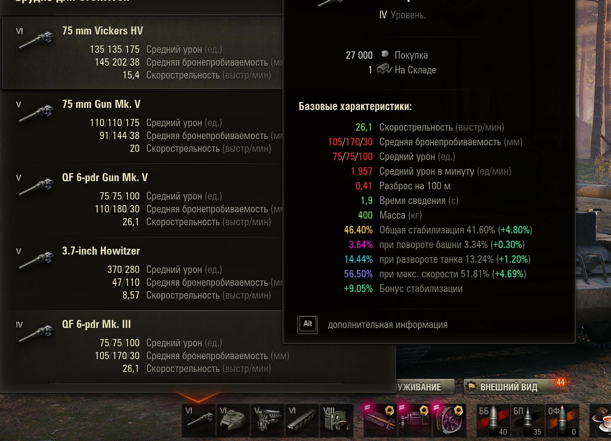
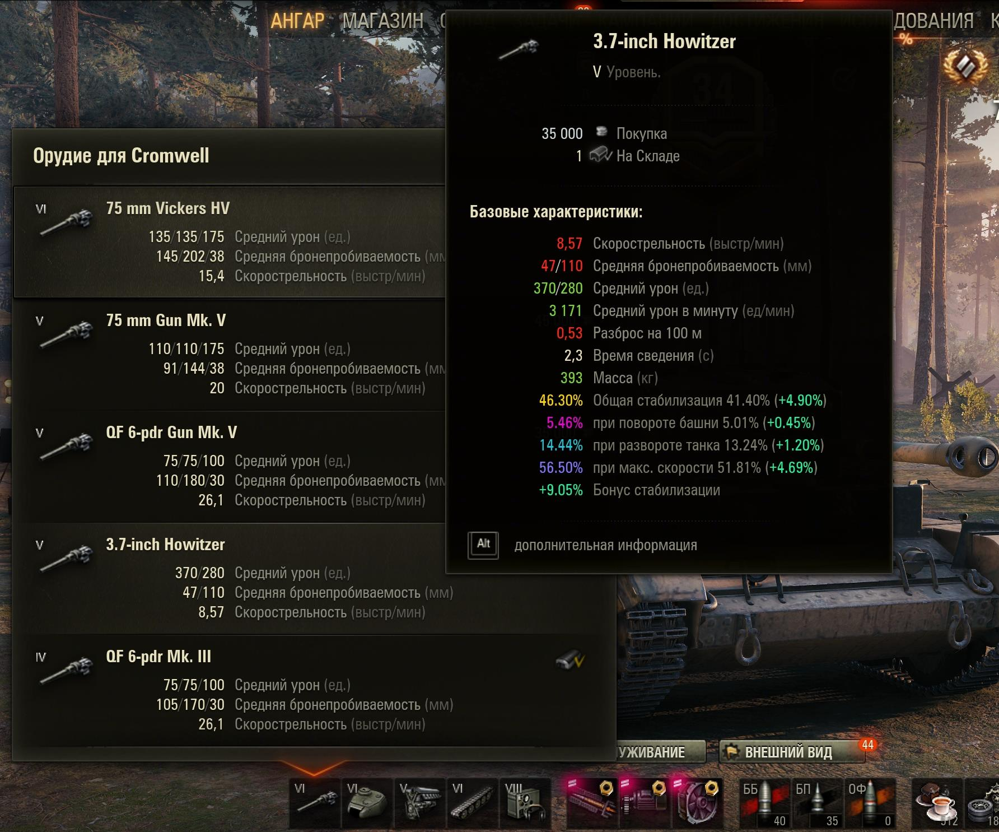
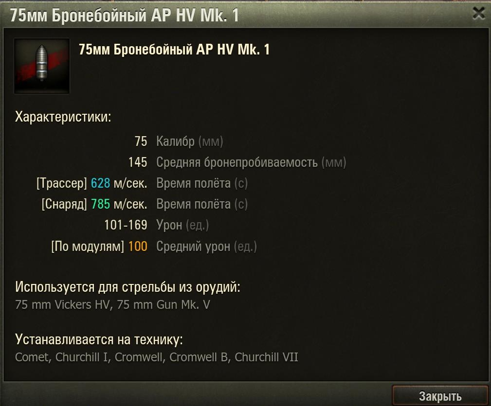

# mod_tooltipsCountItemsLimitExtend
#### Описание мода:
    Расширяет список танков, на котором установлено оборудование (в ангарных подсказках), 
    На складе показывает полную цену продажи модулей, расходников и боеприпасов.
    Показывает информацию о стабилизации танка. (подсказка на орудие)
    Показывает скорость трассера и снаряда, урон по модулям в ангаре и в бою. (подсказка на снаряде)

#### Скриншоты:

